# Novelty_Detection
PyTorch implementation of [Adversarially Learned One-Class Classifier for Novelty Detection](https://arxiv.org/abs/1802.09088)

## Training  
One can start the training by doing the following:  
```
python main.py
```
To __disable__ GPU training use ```--gpu``` key.  

The list of arguments of ```main.py```:  
- --gpu - turns off gpu training  
- --save_path - path to a folder where metrics and models will be saved  
- --d_save_path - name of .pth file where D network will be saved  
- --r_save_path - name of .pth file where R network will be saved  
- --load_path - path to a folder from which models will be loaded  
- --d_load_path - name of .pth file for d_net to be loaded  
- --r_load_path - name of .pth file for r_net to be loaded  
- --batch_size - batch size for training and validation loaders  
- --rec_bound - (rho in the paper) stopping criterion  
- --lr - learning rate  
- --nw - num_workers for data loader  
- --sstep - step in epoch for saving the model  
- --std - standart deviation for noise for training  
- --lambd - lambda parameter for LR loss  
- --res - enables residual connections
- --cat - enables skip connections via concatenation  

## Results  
The model was trained to recognize pictures of _1_ as inliers and others as outliers.  
It was trained using _RMSprop_ with _learning rate_ of 0.0001 and _weight decay_ of 1e-9.  
There are some examples of model perfomance:  
X    | 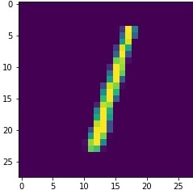 |  |  |  | 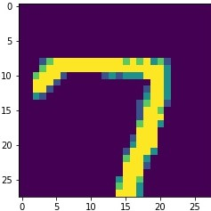
:---:|:--------------------:|:--------------------:|:--------------------:|:--------------------:|:--------------------:
R(X) | 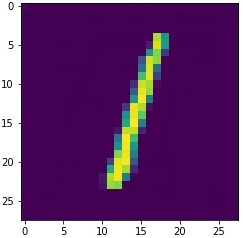 | 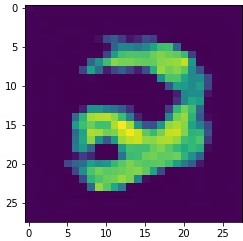 | 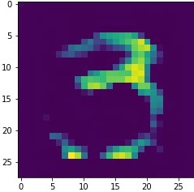 |  | 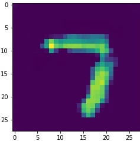  

There are F1-scores for different parameter _tau_ values:  
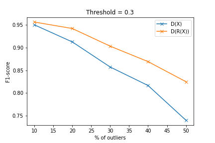  
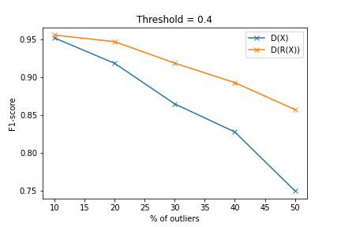  
    

#### Wasserstein loss  
GAN loss, RMSprop(alpha=0.9), lr = 0.001 |GAN loss, RMSprop(alpha=0.9), lr = 0.0001 |Wasserstein loss, Adam(betas=(0.9,0.999)), lr = 0.0001
:-------------------------:|:-------------------------:|:-------------------------:
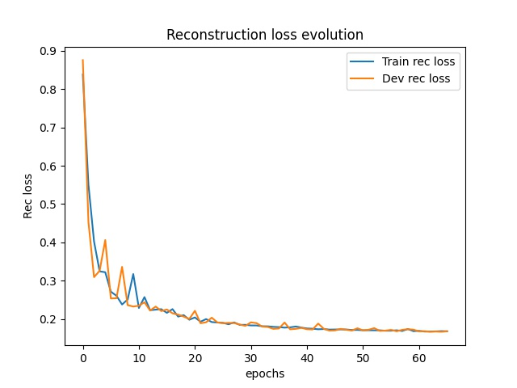||  

#### Skip connections  
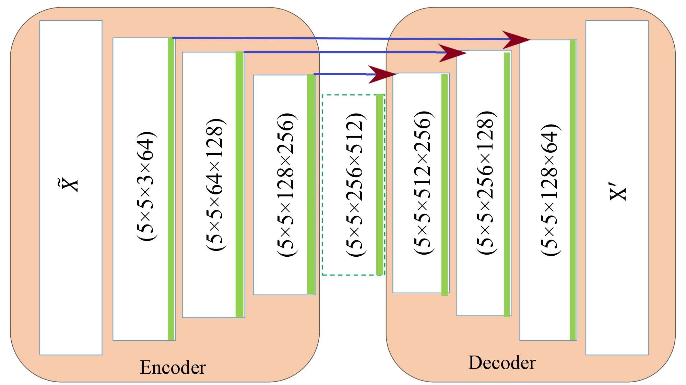  
Residual connections and concatenation were tried. In both cases arrows on the picture above means concatenation or residual connections.  
In the case of concatenation, number of channels in each decoder layer, except the output, is doubled.  
Using residual connections slighlty improves convergence of refinement loss.  
Applying both methods strongly enhances R network, so it becomes very powerful and discriminator can't cope with it.  
There are some rather immature training results:  
Concatenation | Residual connections  
:-------------------:|:-------------:  
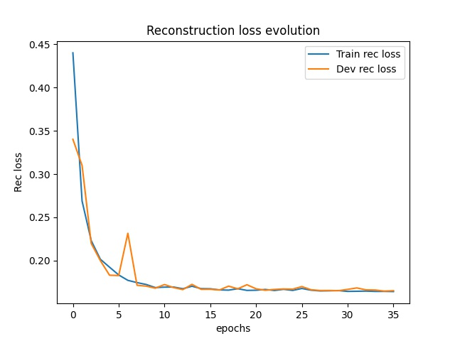 | 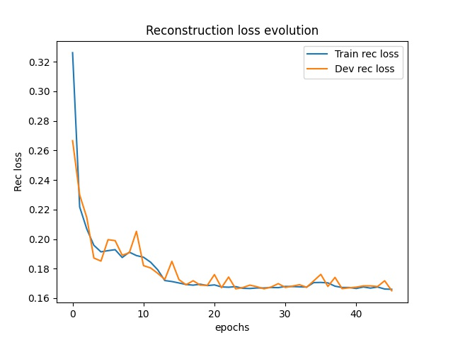  
:-------------------:|:-------------:
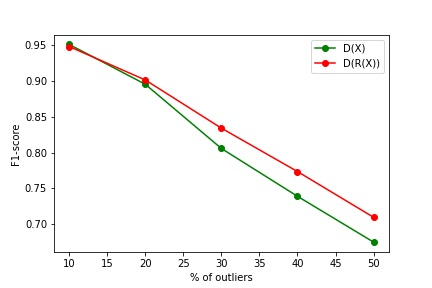 | 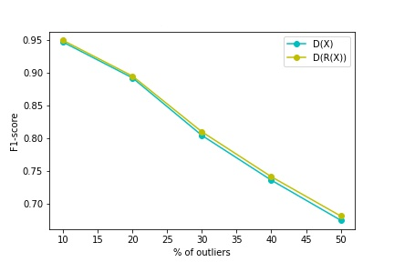  

# Literature  
- [Adversarially Learned One-Class Classifier for Novelty Detection](https://arxiv.org/abs/1802.09088)  
- [Generative Adversarial Networks](https://arxiv.org/abs/1406.2661)  
- [Wasserstein GAN](https://arxiv.org/abs/1701.07875)